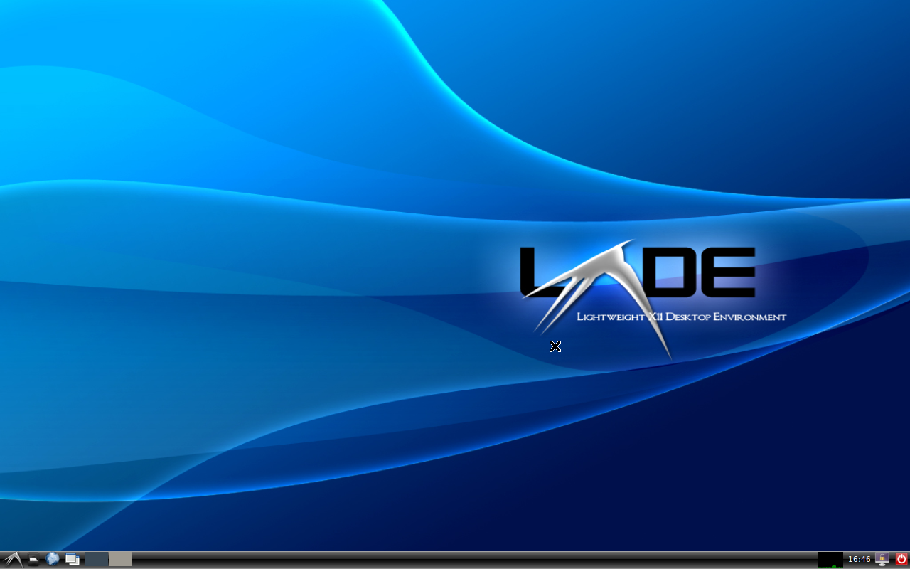
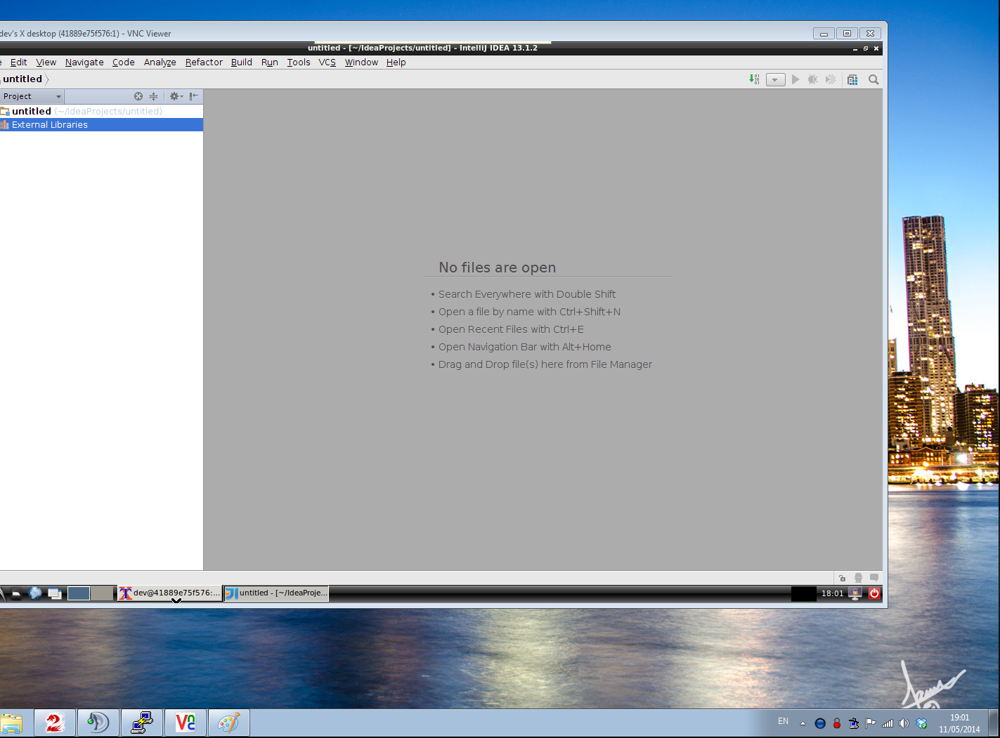

To run, do the following:
	
	docker pull atcol/grails-tomcat7-jdk8

Now run the container in the container:

	docker run -v $HOME/docker/:/home/dev/files:rw -dt -p 5901:5901 --name="desktop" atcol/grails-tomcat7-jdk8

**Note**: change $HOME/docker to a host OS directory of your choosing, for RW storage, but ensure it's read-write permissions for all

VNC is now running on the container, and it'll be detached by default. The VNC password is `docker`.

Now connect using your favourite VNC viewer e.g.:

	vncviewer localhost:5901

and you should see this:

